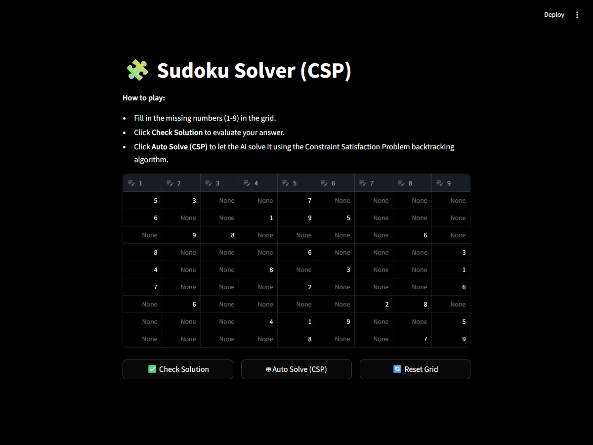
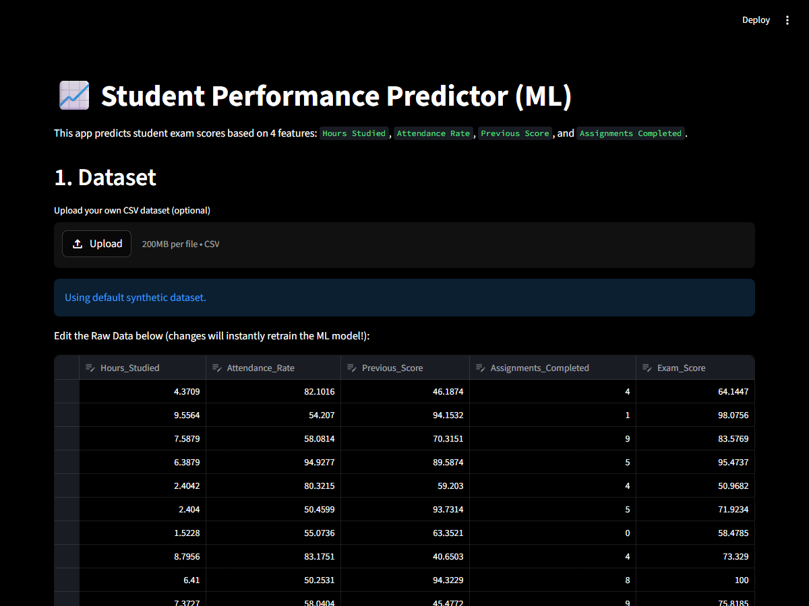
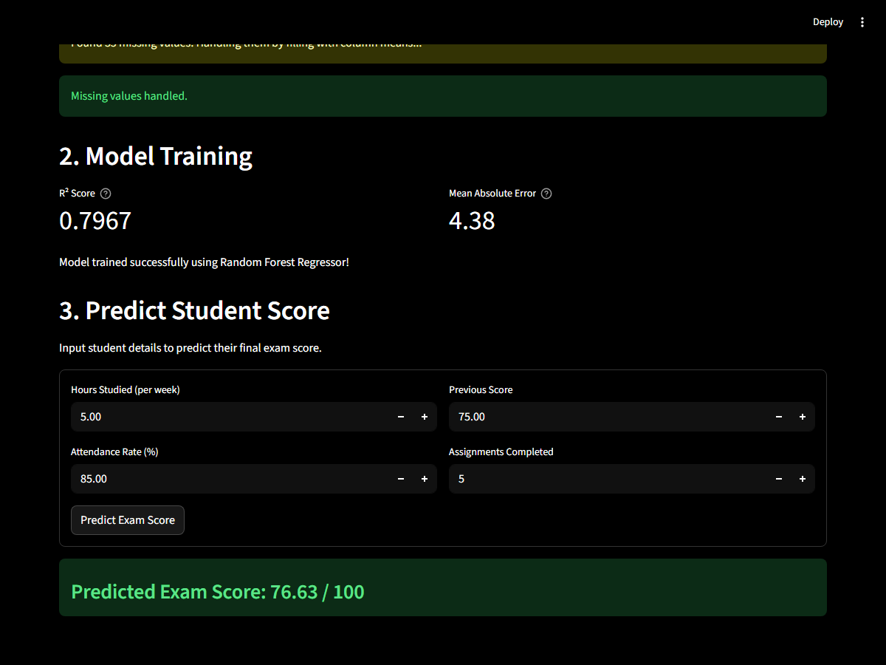

# 🤖 AI Problem Solving Assignment

**Registration Number:** `RA2410026050027`


This repository contains two **completely independent** web applications built from scratch using pure HTML, CSS, and Vanilla JavaScript. There is absolutely no backend or connection between them.

## 🌐 Live Demo Links

| Project | Live Demo |
|---|---|
| 🧩 Sudoku Solver (CSP) | [**Click Here to Try Live →**](https://kalyangadadesi.github.io/AI_ProblemSolving_Assignment-RA2411026050027/Sudoku_Solver/) |
| 📈 Student Predictor (ML) | [**Click Here to Try Live →**](https://kalyangadadesi.github.io/AI_ProblemSolving_Assignment-RA2411026050027/Student_Predictor/) |

---

## 🧩 Problem 6: Sudoku Solver (Constraint Satisfaction Problem)

### Overview
A completely self-contained web app that uses the **Constraint Satisfaction Problem (CSP)** backtracking algorithm written in JavaScript to instantly solve a 9×9 Sudoku puzzle directly in your browser.

### 📸 Screenshots

**Input State — Empty Puzzle Grid**



**Output State — AI Auto-Solved via CSP Backtracking**


### 🌐 Live Demo
👉 **[Try Sudoku Solver Live](https://kalyangadadesi.github.io/AI_ProblemSolving_Assignment-RA2411026050027/Sudoku_Solver/)**

### How to Run Locally
```
1. Navigate to the Sudoku_Solver folder.
2. Double-click index.html to open it in your browser.
```

---

## 📈 Problem 18: Student Performance Predictor (Machine Learning)

### Overview
A purely client-side Machine Learning dashboard. Upon loading the page, it generates 200 synthetic data samples and runs a **Multiple Linear Regression (Gradient Descent)** training loop entirely in the browser using JavaScript. It then accepts user inputs to predict final exam scores in real time.

### 📸 Screenshots

**Input State — Student Metrics Entry Form**



**Output State — ML Predicted Exam Score**



### 🌐 Live Demo
👉 **[Try Student Predictor Live](https://kalyangadadesi.github.io/AI_ProblemSolving_Assignment-RA2411026050027/Student_Predictor/)**

### How to Run Locally
```
1. Navigate to the Student_Predictor folder.
2. Double-click index.html to open it in your browser.
```

---

## 📂 Project Structure
```
AI ASSIGNMENT/
├── README.md
├── Sudoku_Solver/
│   ├── index.html
│   ├── style.css
│   └── script.js
├── Student_Predictor/
│   ├── index.html
│   ├── style.css
│   └── script.js
└── assets/
    ├── sudoku_input.png
    ├── sudoku_output.png
    ├── predictor_input.png
    └── predictor_output.png
```
